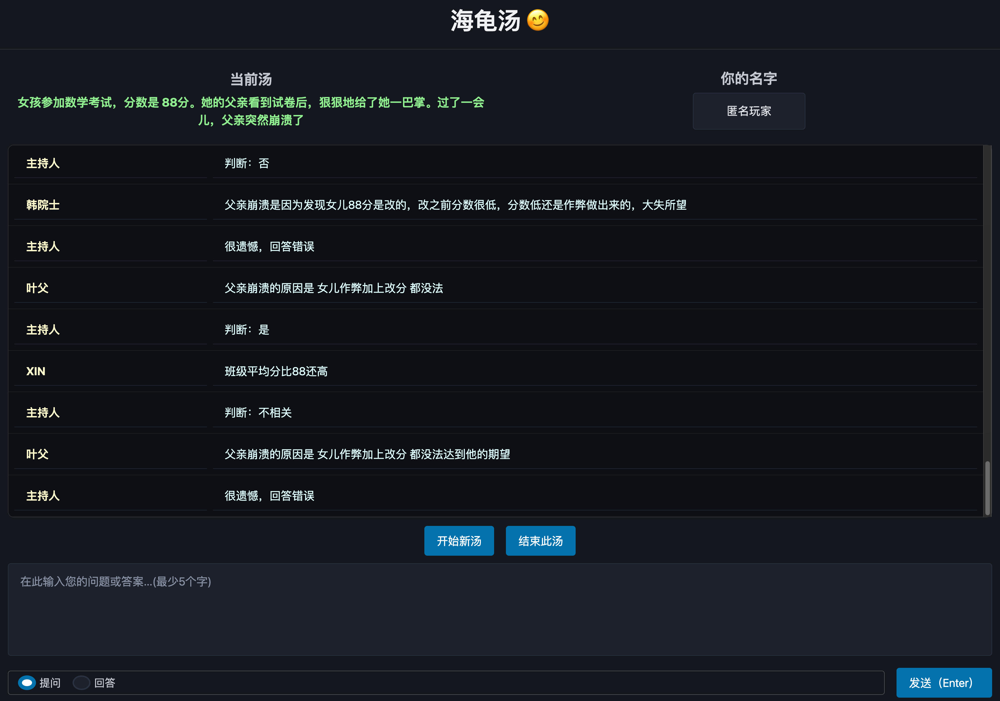

# 🐢 CameSoup - 海龟汤游戏 (Situation Puzzle Game)

This is an experimental project exporing AI agents on gaming.


An AI-powered web application for playing Situation Puzzles (海龟汤), where players ask yes/no questions to uncover the hidden truth behind mysterious scenarios.



## Basic Design
There are two agents, judge_agent, and answer agent;


- judge agent judge whether user's question is true/false, or non-sense;

- answer agent determine whether user's answer is almost correct and hit key points;

The current puzzle is injected to them as dynamic prompts/instructions, therefore no long-memory/context is required.

## Quick Start

### Setting

- create .env and set your AI API key;
- change the underlying model in soup/agents/*_agent.py


### Run the app

For webUI:
```
uv run python main.py

// supports multi-player at the same time
```

Then visit 
> https://your_ip:42345

For terminal CLI:
```
uv run python main.py --cli
```

Port can be set in web/app.py


## Acknowledgments
- Pico.css
- PydanticAI
